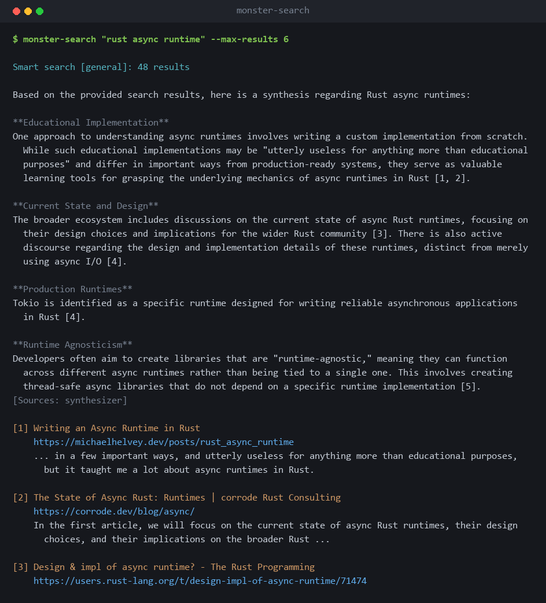
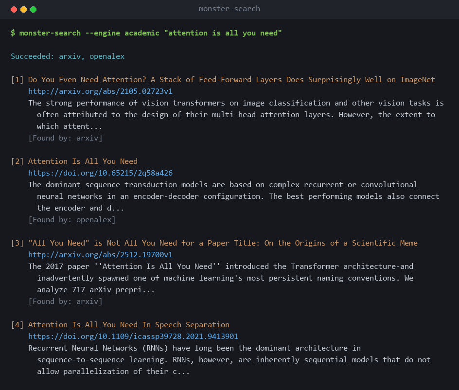
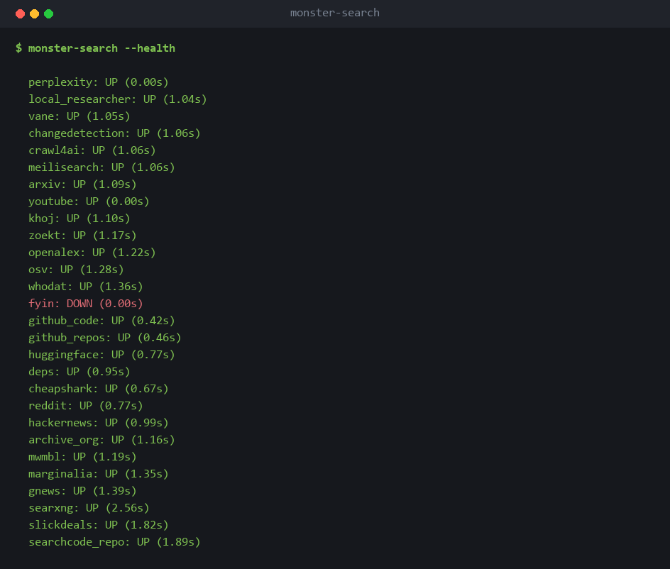

# monster-search

[](https://github.com/scaso01/monster-search/actions/workflows/ci.yml)
[](https://www.python.org/downloads/)
[](LICENSE)

Ask one question, get answers from 34 search engines at once. Web, academic,
code, security, packages, WHOIS, news, video, AI, community, archive and
shopping, behind a single CLI and Python API.

It reads the query first and only runs the engines that suit it, so a CVE
identifier goes to the vulnerability databases and a paper title goes to the
academic ones. Results from every engine are merged into one ranked list
rather than shown as separate piles.

Everything it talks to is either a free public API or something you host
yourself. There is no paid tier and no account to sign up for.



## Quick Start

```bash
# Install
git clone https://github.com/scaso01/monster-search.git
cd monster-search
pip install -e ".[dev]"

# Search (smart tiered default -- runs tier1 engines in parallel, ~15-60s)
monster-search "python asyncio best practices"

# Fast lookup (~3s)
monster-search --engine searxng "python asyncio"

# Deep search including slow AI engines (~2-5 min)
monster-search --deep "supply chain attacks 2026"

# Check service health
monster-search --health
```

## Engines

34 engines organized into 12 categories, executed in 3 priority tiers.

### Engine Table

| Engine | Category | Tier | Source | Time |
|--------|----------|------|--------|------|
| SearXNG | Web General | 1 | Self-hosted (Docker, :8080) | ~3-4s |
| Marginalia | Web General | 1 | External API | ~3s |
| mwmbl | Web General | 1 | External API | ~3s |
| Perplexity | Web AI | 1 | External (cookie auth) | ~30s |
| Synthesizer | Web AI | 1 | SearXNG + Crawl4AI + llama-server | ~30-60s |
| Vane | Web AI | 2 | Self-hosted (Docker, :3004) | ~2 min |
| Khoj | Web AI | 2 | Self-hosted (Docker, :42110) | ~2 min |
| Fyin | Web AI | 2 | CLI on a host you reach over SSH | ~2 min |
| Local Deep Researcher | Web AI | 3 | Self-hosted (Docker, :8300) | ~3-8 min |
| arXiv | Academic | 1 | External API | ~3s |
| Semantic Scholar | Academic | 1 | External API | ~3s |
| OpenAlex | Academic | 1 | External API | ~3s |
| Zoekt | Code | 1 | Self-hosted index | ~1s |
| OSV | Security | 1 | External API (osv.dev) | ~2s |
| deps.dev | Packages | 1 | External API | ~2s |
| Who-Dat | Domain/WHOIS | 1 | Self-hosted (Docker, :8083) | ~1s |
| News (SearXNG) | News | 1 | Self-hosted (Docker, :8080) | ~5s |
| GNews | News | 1 | External RSS | ~2s |
| Archive.org | Archive | 1 | External API (CDX + catalog) | ~10s |
| YouTube | Video | 1 | yt-dlp + youtube-transcript-api | ~5-10s |
| grep.app | Code | 1 | External API | ~3s |
| GitHub Code Search | Code | 1 | gh CLI subprocess | ~5s |
| GitHub Repos | Code | 1 | gh CLI subprocess | ~3s |
| searchcode_repo | Code | opt-in | searchcode.com API (requires --repo) | ~2s |
| Hacker News | Community | 1 | Algolia API | ~2s |
| HuggingFace | AI/ML | 1 | HuggingFace Hub API | ~3s |
| Reddit | Community | 1 | Reddit Atom feed | ~3s |
| CheapShark | Shopping | 1 | CheapShark API | ~2s |
| SlickDeals | Shopping | 1 | SlickDeals API | ~3s |
| Crawl4AI | Utility | -- | Self-hosted (Docker, :11235) | ~15s |
| changedetection.io | Utility | -- | Self-hosted (Docker, :8086) | -- |

**Notes:**
- Tier 1 engines run on every query by default (always-on + router-gated specialists).
- Tier 2 engines auto-promote when tier 1 results are sparse (< 3 results).
- Tier 3 engines only run with `--deep` or for deep-research queries.
- Crawl4AI takes URLs (page extraction), not queries. changedetection.io monitors URL changes.
- Meilisearch runs as a background result cache (not a search engine).
- Router-gated engines (academic, security, packages, code, WHOIS, archive) activate only when the query matches their category via regex classification.

### Categories

| Category | Engines | Trigger |
|----------|---------|---------|
| Web General | searxng, marginalia, mwmbl | Always on |
| Web AI | perplexity, synthesizer, vane, khoj, fyin, local_researcher | Always on (tier1) / promoted (tier2) / deep (tier3) |
| Academic | arxiv, semantic_scholar, openalex | Query contains paper/research/arxiv/doi keywords |
| Code | zoekt, grepapp, github_code, github_repos | Query contains code constructs (.py, func, class, etc.) |
| Security | osv | Query contains CVE/GHSA/vulnerability keywords |
| Packages | deps | Query contains ecosystem prefix (npm:, pypi:, cargo:, etc.) |
| Domain/WHOIS | whodat | Query contains domain name or IP address |
| News | news, gnews | Query contains latest/breaking/headlines keywords |
| Archive | archive_org | Query contains wayback/archive/cached keywords or is a URL |
| Video | youtube | Query contains video/tutorial/watch keywords |
| Community | hackernews, reddit | Query contains discussion/forum/community keywords |
| AI/ML | huggingface | Query contains model/dataset/ML keywords |
| Shopping | cheapshark, slickdeals | Query contains buy/price/deal/discount keywords |

## Smart Tiered Execution

The default search mode (`monster-search "query"`) uses smart tiering:

1. **Classify** the query via regex patterns (security, academic, code, news, etc.)
2. **Run tier 1** engines in parallel (always-on + category-matched specialists)
3. **Auto-promote tier 2** if tier 1 yields fewer than 3 results
4. **Tier 3** only runs with `--deep` or for deep-research queries
5. **Fuse** results via weighted Reciprocal Rank Fusion (RRF)
6. **Deduplicate** via MinHash LSH content similarity

```
Tier 1 (fast, ~15-60s):  searxng, marginalia, news, gnews, perplexity,
                          synthesizer, + router-gated specialists
Tier 2 (medium, ~2 min): vane, khoj, fyin
Tier 3 (slow, ~3-8 min): local_researcher
```

### Circuit Breakers

Each engine has an independent circuit breaker. After repeated failures, the breaker opens and skips that engine for a cooldown period -- preventing one broken service from slowing down the entire search.

### RRF Fusion

Results from multiple engines are combined using weighted Reciprocal Rank Fusion. Each engine has a quality weight (perplexity: 1.0, searxng: 0.9, marginalia: 0.85, etc.). Duplicate URLs are merged with metadata from all contributing engines.

### MinHash Dedup

After fusion, a MinHash LSH pass removes near-duplicate content based on snippet similarity (Jaccard threshold 0.5, 3-gram shingles). Short texts fall back to URL-based dedup.

## CLI Reference

```
monster-search [OPTIONS] QUERY
```

### Core Options

| Flag | Description |
|------|-------------|
| `--engine NAME` | Run a specific engine or category alias |
| `--deep` | Include slow AI engines (tier2 + tier3) |
| `--category {general,news,images,science,files}` | SearXNG category filter |
| `--time-range {day,week,month,year}` | Time-filtered results |
| `--max-results N` | Override default (5) |
| `--json` | JSON output for piping |
| `--no-fuse` | Disable RRF fusion (legacy first-occurrence dedup) |
| `--model MODEL` | Override LLM model for AI engines |
| `--benchmark` | Benchmark engines with timing table |
| `--health` | Check service health status |

### Engine and Category Aliases

```bash
# Individual engines
monster-search --engine searxng "query"
monster-search --engine marginalia "query"
monster-search --engine perplexity "query"
monster-search --engine synthesizer "query"       # alias: --engine synth
monster-search --engine vane "query"
monster-search --engine khoj "query"
monster-search --engine fyin "query"
monster-search --engine local_researcher "query"
monster-search --engine news "topic"
monster-search --engine gnews "topic"
monster-search --engine archive_org "query or URL"
monster-search --engine crawl "https://url"        # page extraction (URL only)
monster-search --engine arxiv "transformer"
monster-search --engine semantic_scholar "attention"
monster-search --engine openalex "machine learning"
monster-search --engine osv "pypi:jinja2"
monster-search --engine deps "npm:express"
monster-search --engine whodat "example.com"
monster-search --engine zoekt "func main"

# Category aliases (run the grouped engines in parallel and fuse the results)
monster-search --engine academic "transformer"     # arxiv + semantic_scholar + openalex
monster-search --engine code "func main"           # zoekt + grepapp + github_code
monster-search --engine security "pypi:jinja2"     # osv
monster-search --engine packages "npm:express"     # deps
monster-search --engine whois "example.com"        # whodat
monster-search --engine video "rust tutorial"      # youtube
monster-search --engine ai_ml "text generation"    # huggingface
monster-search --engine shopping "laptop"          # searxng shopping + slickdeals + cheapshark
                                                   #   + deals_rss + priceghost + amazon + newegg
monster-search --engine deals "ssd"                # slickdeals + deals_rss + amazon

# Full sweep
monster-search --engine all "query"                # all 34 engines (~2-5 min)
```

An alias runs its engines concurrently and merges what comes back, so a single
academic query returns arXiv and OpenAlex results interleaved by rank rather
than grouped by source:



### URL Change Monitoring

```bash
monster-search watch add "https://example.com" --tag news
monster-search watch list
monster-search watch list --tag news
monster-search watch check UUID
monster-search watch diff UUID
monster-search watch remove UUID
```

## Python API

```python
from monster_search import (
    SearXNGClient, AllEnginesClient, MarginaliaClient,
    PerplexityClient, Crawl4AIClient, LocalResearcherClient,
    NewsSearchClient, ArchiveOrgClient, VaneClient,
    ChangeDetectionClient, Config, check_health,
)
import asyncio

# Quick search (~3s)
results = SearXNGClient().search("python asyncio", max_results=5)

# AI synthesis (~30s)
message, results = PerplexityClient().search("latest frameworks")

# Smart tiered search (async, recommended default)
client = AllEnginesClient()
message, results = asyncio.run(client.smart_search("query"))

# Deep search including slow engines
message, results = asyncio.run(client.smart_search("query", include_slow=True))

# Page extraction (takes URL, not query)
content, results = Crawl4AIClient().search("https://example.com")

# URL monitoring
cd = ChangeDetectionClient()
cd.add_watch("https://github.com/trending", tag="github")

# Health check
status = check_health()
```

### SearchResult Model

Every engine returns `SearchResult` objects:

```python
@dataclass(frozen=True, slots=True)
class SearchResult:
    title: str
    url: str
    snippet: str
    source: str                          # engine name or "fused"
    engine: str | None = None            # upstream engine (e.g., "google")
    score: float | None = None
    published: str | None = None
    category: str | None = None
    sources: tuple[str, ...] | None = None   # engines that found this URL
    fused_score: float | None = None         # weighted RRF score
```

## Prerequisites

**Nothing, to start with.** Python 3.12 and `pip install` are enough. Every
engine in the "external APIs" table below is free and keyless, so a fresh clone
searches roughly twenty engines out of the box. Anything you have not set up
reports itself as unavailable and is skipped, rather than failing the search.

The rest are services you host yourself. Each one adds engines; none is
required. Point the matching `MONSTER_*_URL` at wherever you run it, and leave
it unset to keep that engine switched off.

| Service | Default port | Adds |
|---------|--------------|------|
| [SearXNG](https://github.com/searxng/searxng) | :8080 | General web and news search, plus the sources the synthesizer writes from |
| [Vane](https://github.com/ItzCraworzyy/Perplexica) | :3004 | AI search (a Perplexica fork) |
| [Khoj](https://github.com/khoj-ai/khoj) | :42110 | AI chat and search, anonymous mode |
| [Local Deep Researcher](https://langchain-ai.github.io/langgraph/) | :8300 | Iterative multi-step research |
| [Crawl4AI](https://github.com/unclecode/crawl4ai) | :11235 | Extraction of JavaScript-rendered pages |
| [changedetection.io](https://github.com/dgtlmoon/changedetection.io) | :8086 | The `watch` subcommands |
| [Who-Dat](https://github.com/MoeClub/whodat) | :8083 | WHOIS lookups |
| [Zoekt](https://github.com/sourcegraph/zoekt) | :6070 | Regex code search across your own repositories |
| [Meilisearch](https://github.com/meilisearch/meilisearch) | :7700 | A cache, so repeat queries return instantly |
| Any OpenAI-compatible LLM | :8080 | The synthesizer's written answer. [llama-server](https://github.com/ggml-org/llama.cpp), Ollama and vLLM all work |

External APIs (no containers):

| Service | Auth | Notes |
|---------|------|-------|
| [Marginalia](https://search.marginalia.nu/) | None | Independent web index, CC-BY-NC-SA 4.0 |
| [Perplexity](https://www.perplexity.ai/) | Session cookie | Manual refresh ~monthly |
| [arXiv](https://arxiv.org/) | None | Preprint search API |
| [Semantic Scholar](https://www.semanticscholar.org/) | None | Academic paper search |
| [OpenAlex](https://openalex.org/) | None | Open scholarly works |
| [OSV.dev](https://osv.dev/) | None | Vulnerability database |
| [deps.dev](https://deps.dev/) | None | Package metadata |
| [Who-Dat](https://github.com/MoeClub/whodat) | None | WHOIS lookup |
| [GNews](https://news.google.com/) | None | Google News RSS |
| [Archive.org](https://archive.org/) | None | CDX + Advanced Search |

One engine, **fyin**, is a CLI binary rather than a service, so it runs over
SSH on a host where you have installed it. It stays off until you set
`MONSTER_SSH_HOST`. See [Engines that run over SSH](#engines-that-run-over-ssh).

`--health` shows you where you stand. It issues a real query against every
engine rather than pinging a port, so an engine that answers but returns
nothing usable is reported as down. Below, everything is configured except
fyin, which has no SSH host set.



## Architecture

```
src/monster_search/
├── __init__.py              # Public API exports
├── models.py                # SearchResult frozen dataclass (sources, fused_score)
├── config.py                # Config from MONSTER_* env vars
├── health.py                # Container health probes
├── cli.py                   # CLI entry point (argparse + watch routing)
├── benchmark.py             # Engine benchmarking (--benchmark)
├── fusion.py                # Weighted RRF with metadata merge
├── _tiered.py               # Tiered execution engine (tier1/2/3)
├── _router.py               # Regex query classifier (9 categories)
├── _breaker.py              # Per-engine circuit breakers
├── _dedup.py                # MinHash LSH content deduplication
├── __main__.py              # python -m support
└── clients/
    ├── _pool.py                  # Connection pool (reusable httpx clients)
    ├── searxng.py                # SearXNG JSON API (sync + async)
    ├── marginalia.py             # Marginalia independent search
    ├── perplexity_client.py      # Perplexity AI synthesis (cookie auth)
    ├── synthesizer.py            # AI synthesis (SearXNG + Crawl4AI + llama-server)
    ├── local_researcher.py       # Local Deep Researcher LangGraph REST
    ├── crawl4ai_client.py        # Crawl4AI page extraction
    ├── news.py                   # SearXNG news category, date-sorted
    ├── gnews.py                  # Google News RSS
    ├── archive_org.py            # Archive.org CDX + Advanced Search
    ├── vane.py                   # Vane AI search (dynamic provider IDs)
    ├── khoj.py                   # Khoj AI chat/search (anonymous)
    ├── fyin.py                   # Fyin search over SSH
    ├── arxiv.py                  # arXiv preprint search
    ├── semantic_scholar.py       # Semantic Scholar papers
    ├── openalex.py               # OpenAlex works
    ├── osv.py                    # OSV.dev vulnerabilities
    ├── deps.py                   # deps.dev package info
    ├── whodat.py                 # Who-Dat WHOIS lookup
    ├── zoekt.py                  # Zoekt code search
    ├── meilisearch_client.py     # Meilisearch result cache (background)
    ├── changedetection_client.py # changedetection.io URL monitoring
    └── all_engines.py            # Composite: tiered parallel + RRF fusion
```

## Configuration

All settings via `MONSTER_*` environment variables. Copy `.env.example` to `.env`:

```bash
cp .env.example .env
```

Key variables:

| Variable | Default | Description |
|----------|---------|-------------|
| `MONSTER_SEARXNG_URL` | `http://localhost:8080` | SearXNG base URL |
| `MONSTER_DEFAULT_ENGINE` | `all` | Default CLI engine |
| `MONSTER_MAX_RESULTS` | `5` | Results per engine |
| `MONSTER_TIMEOUT` | `15` | HTTP timeout (SearXNG) |
| `MONSTER_PERPLEXITY_SESSION_TOKEN` | -- | Perplexity cookie (monthly refresh) |
| `MONSTER_PERPLEXITY_TIMEOUT` | `90` | Perplexity timeout |
| `MONSTER_VANE_URL` | `http://localhost:3004` | Vane AI search URL |
| `MONSTER_VANE_TIMEOUT` | `300` | Vane timeout |
| `MONSTER_KHOJ_URL` | `http://localhost:42110` | Khoj AI search URL |
| `MONSTER_KHOJ_TIMEOUT` | `300` | Khoj timeout |
| `MONSTER_ZOEKT_URL` | `http://localhost:6070` | Zoekt code search URL |
| `MONSTER_WHODAT_URL` | `http://localhost:8083` | Who-Dat WHOIS URL |
| `MONSTER_MEILISEARCH_URL` | `http://localhost:7700` | Meilisearch result cache URL |
| `MONSTER_MEILISEARCH_KEY` | -- | Meilisearch API key |
| `MONSTER_LLAMA_URL` | `http://localhost:8080` | OpenAI-compatible endpoint for the synthesizer |
| `MONSTER_SYNTHESIZER_TIMEOUT` | `120` | Synthesizer timeout |
| `MONSTER_SSH_HOST` | -- | Remote host for the SSH-routed engines (see below) |
| `MONSTER_FYIN_ENV_FILE` | -- | Optional env file sourced on that host before fyin |
| `MONSTER_FYIN_TIMEOUT` | `300` | Fyin SSH timeout |
| `MONSTER_LOCAL_RESEARCHER_URL` | `http://localhost:8300` | Local Deep Researcher URL |
| `MONSTER_LOCAL_RESEARCHER_TIMEOUT` | `600` | Local Researcher timeout |
| `MONSTER_CRAWL4AI_URL` | `http://localhost:11235` | Crawl4AI URL |
| `MONSTER_CRAWL4AI_TIMEOUT` | `60` | Crawl4AI timeout |
| `MONSTER_ARCHIVE_ORG_TIMEOUT` | `60` | Archive.org timeout |
| `MONSTER_CHANGEDETECTION_URL` | `http://localhost:8086` | changedetection.io URL |
| `MONSTER_CHANGEDETECTION_API_KEY` | -- | changedetection.io API key |
| `MONSTER_SEMANTIC_SCHOLAR_API_KEY` | -- | Free key; without one the engine is skipped |
| `MONSTER_GREPAPP_ENABLED` | `false` | grep.app is off by default (it 429s many networks) |

`.env.example` lists every variable with its real default. The two are checked
against each other, so if a default here disagrees with the code, that is a bug.

### Engines that run over SSH

Two engines shell out over SSH instead of speaking HTTP, and both are off until
you set `MONSTER_SSH_HOST` to something `ssh` accepts (`user@host`):

- **fyin** needs the `fyin` binary installed on that host. Without a host set it
  reports as disabled rather than failing at query time.
- **archive.org** queries go out directly by default. archive.org rate-limits
  some VPN exit IPs hard — a persistent HTTP 429 on CDX, sometimes a TCP
  timeout — so setting a host reroutes the request through `curl` there
  instead. Only do this if your own exit IP is one of the blocked ones.

Nothing else in the tool opens an SSH connection.

## Testing

```bash
# Unit tests: every HTTP call mocked, no services needed. This is what CI runs.
pytest tests/ -m "not integration"

# Integration tests: real requests against real services.
pytest tests/test_integration.py -m integration

# ...without the AI engines, which take about two minutes each.
pytest tests/test_integration.py -m "integration and not slow"

# Lint
pyflakes src/monster_search/ tests/
```

The unit suite mocks HTTP through `respx` and makes no network calls, so it is
deterministic and safe to run anywhere.

The integration suite is the one that catches engines which have quietly
stopped working. Search providers change endpoints without warning, and a
mocked test keeps passing when that happens because the mock still returns the
old shape. Every test there skips itself when the service it needs is
unreachable or unconfigured, so a partial setup produces skips rather than
failures.

## License

MIT License. See [LICENSE](LICENSE) for details.
